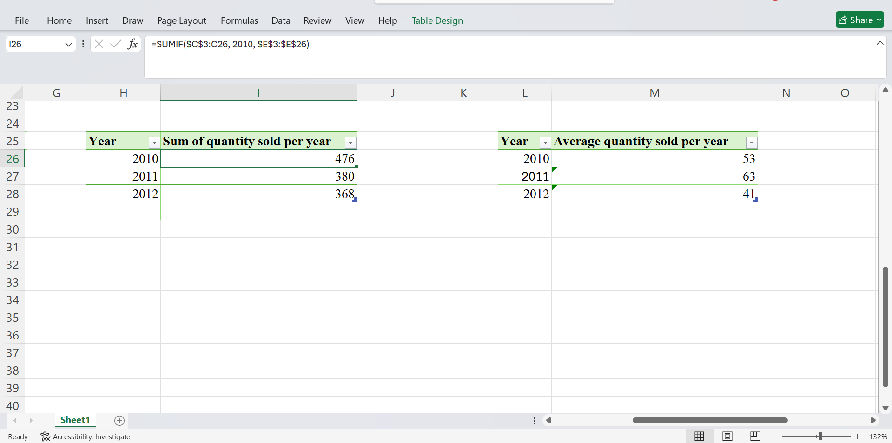
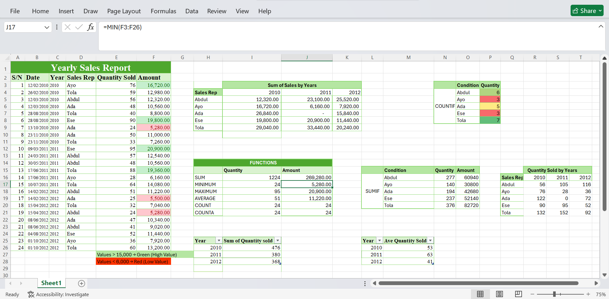
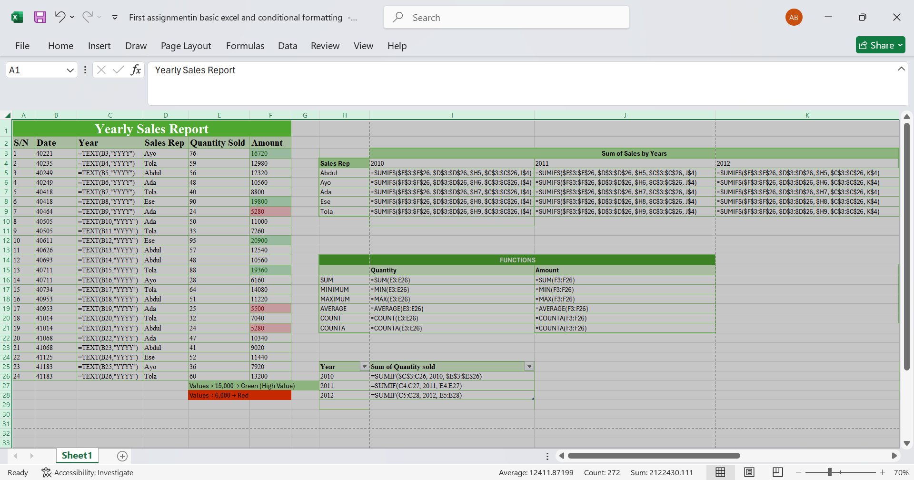
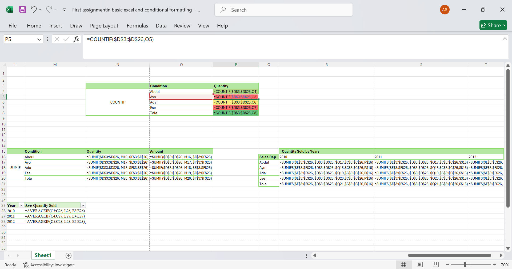
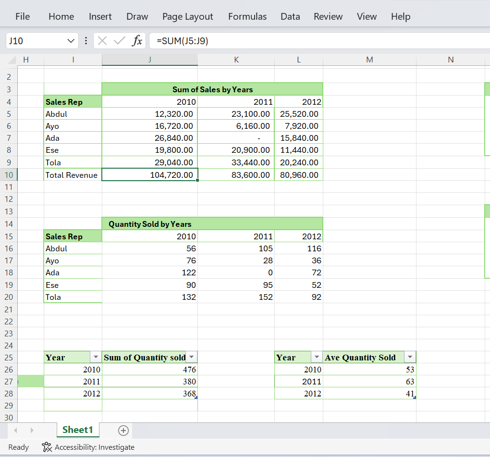

# kabir-sales-analysis
Regional Sales Performance Analysis
## Executive Summary
Over the three-year period  at Kabeer Retail Solutions, sales are decreasing, indicating a decline in overall business performance and weakening business health. The performance trends however suggest that there is inconsistent growth in the performance of sales Representatives. 

Representative Performance Table
 Visual evidence here, indicate uneven performance across sales representatives, with some showing consistent growth while others experience declining trends over the three-year period. 

Yearly Performance Table

Overall Analysis

## Business Recommendations
The sales representative with the highest transaction count but not the highest revenue is Abdul. This suggests that there is need for the sales representatives to focus on increasing total revenue no just the quantity.

Based on the yearly performance, there is consistent decline in revenue over the years.

Total revenue per year, 2010 Revenue: 104,720

                        2011 Revenue: 83,600
                        
                        2012 Revenue: 80,960

This indicate product demand and sales performance is declining, suggesting that the company should reduce staff in 2013, and focus on improving the value of their product and training their sales reps on high-value selling techniques. This will increase revenue per transaction, not just the sales volume.

