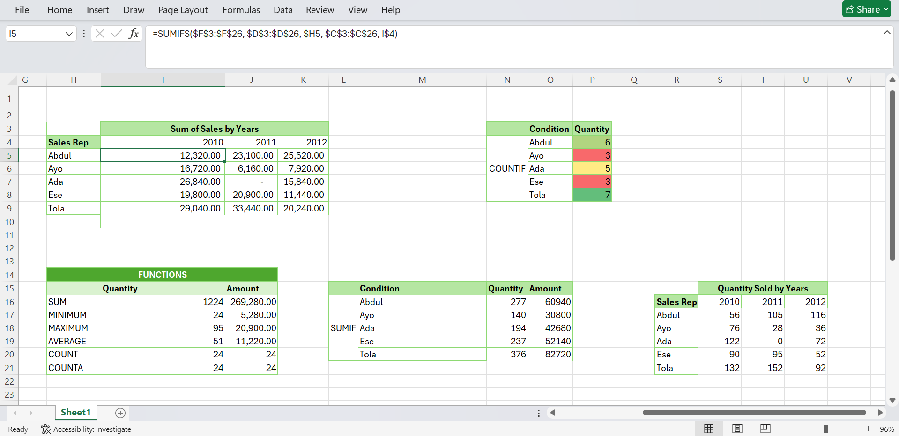

# kabir-sales-analysis
Regional Sales Performance Analysis
## Executive Summary
Over the three-year period  at Kabeer Retail Solutions, sales are decreasing, indicating a decline in overall business performance and weakening business health. The performance trends however suggest that there is inconsistent growth in the performance of sales Representatives. Key insights indicate uneven performance across sales representatives, with some showing consistent growth while others experience declining trends over the three-year period. 

Representative Performance Table

